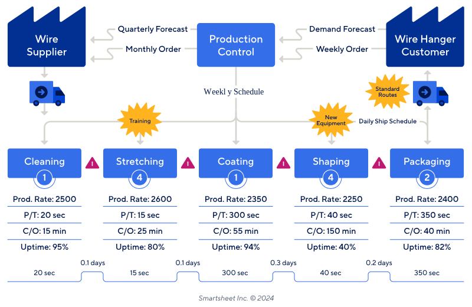
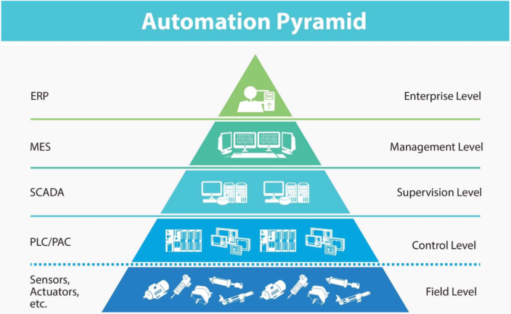
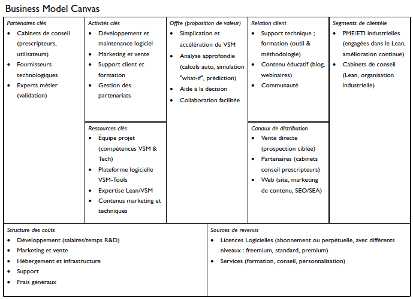

# Rapport de Présentation : VSM-Tools - Optimisation des Flux de Valeur

## 1. Introduction : Le Contexte Essentiel du Value Stream Mapping (VSM)

Avant de plonger dans les spécificités de notre solution, il est fondamental de comprendre le concept sur lequel elle repose : le Value Stream Mapping (VSM), ou Cartographie des Flux de Valeur.

**1.1. Qu'est-ce que le VSM ?**

Le VSM est une méthode visuelle issue du Lean Management. Son objectif principal est simple mais essentiel : **visualiser, analyser et améliorer l'ensemble des flux** (matière et information) nécessaires pour amener un produit ou un service du fournisseur jusqu'au client. Il s'agit de cartographier toutes les étapes, qu'elles ajoutent de la valeur ou non, afin d'obtenir une image claire et complète du processus actuel.

**1.2. L'importance du VSM dans l'industrie moderne**

Dans un environnement économique où l'efficacité et la réactivité sont primordiales, le VSM s'avère être un **outil pertinent pour l'analyse et l'amélioration des performances**. Il permet de :
*   **Identifier et quantifier les gaspillages** (Muda) : Temps d'attente, stocks excessifs, mouvements inutiles, surproduction, défauts, etc.
*   **Localiser précisément les goulots d'étranglement** qui limitent la capacité globale du flux.
*   **Réduire les délais de production (Lead Time)** : En optimisant le flux et en traitant les goulots, on livre plus rapidement le client.
*   **Améliorer la productivité et réduire les coûts** : En éliminant les activités sans valeur ajoutée et en fluidifiant le processus.
*   **Favoriser une culture d'amélioration continue (Kaizen)** : Le VSM fournit une base factuelle pour identifier les chantiers d'optimisation prioritaires, notamment sur les points de blocage.

**1.3. Place du VSM dans la démarche d'amélioration**

Le VSM n'est pas une fin en soi, mais un **outil clé au cœur des démarches Lean**. Il sert de diagnostic initial pour comprendre où se situent les problèmes dans un flux de valeur. Les informations issues de la cartographie "état actuel" permettent ensuite de concevoir un "état futur" optimisé et de définir les plans d'actions concrets pour y parvenir. C'est un langage commun pour aligner les équipes autour des objectifs d'amélioration.

**1.4. Qui bénéficie du VSM ?**

La démarche VSM concerne de nombreux acteurs au sein d'une organisation :
*   **Les Ingénieurs Process et Méthodes** : Pour analyser et optimiser les processus de fabrication ou de service.
*   **Les Responsables Production et Logistique** : Pour améliorer les flux physiques et réduire les stocks.
*   **Les Responsables Qualité** : Pour identifier les sources de défauts et améliorer la satisfaction client.
*   **Les Équipes d'Amélioration Continue / Lean Managers** : Comme outil fondamental de leur méthodologie.
*   **Les Consultants en Organisation et Management** : Pour diagnostiquer rapidement les inefficacités chez leurs clients.
*   **La Direction Générale** : Pour avoir une vision claire de la performance opérationnelle et orienter la stratégie.

**1.5. Le défi des méthodes traditionnelles**

Historiquement, la réalisation de VSM s'appuyait souvent sur des moyens rudimentaires :
*   **Papier et Post-it** : Utile pour une première approche collaborative, mais difficile à maintenir, partager, et analyser quantitativement.
*   **Tableurs (Excel, etc.)** : Permettent certains calculs mais manquent de visualisation intuitive et de standardisation VSM.
*   **Logiciels de dessin génériques (Visio, etc.)** : Offrent la flexibilité du dessin mais sont dépourvus d'intelligence métier spécifique au VSM (pas de calculs automatiques des indicateurs clés, pas de liens logiques entre éléments).

Ces méthodes traditionnelles, bien que répandues, présentent des limites en termes d'efficacité, de collaboration, de précision des calculs et de capacité à simuler facilement des scénarios d'amélioration. C'est précisément pour répondre à ces défis que VSM-Tools a été conçu.

## 2. VSM-Tools : Un Levier d'Optimisation des Flux

Face aux limites des approches traditionnelles et à l'importance reconnue du VSM, VSM-Tools a été développé comme une solution logicielle dédiée à la cartographie et à l'analyse des flux de valeur.

**2.1. Mission**

La mission de VSM-Tools est de **rendre l'analyse VSM accessible, rapide et actionnable pour les entreprises** souhaitant améliorer leur performance opérationnelle. L'objectif est de faciliter l'utilisation de cet outil en levant les barrières liées à la complexité ou au manque d'outils adaptés.

**2.2. Vision**

VSM-Tools aspire à devenir **un outil de référence pour une cartographie VSM intuitive et efficace**. La solution vise non seulement à faciliter la création des cartes, mais également à guider l'utilisateur dans l'analyse et l'identification des pistes d'amélioration pertinentes.

**2.3. Proposition de valeur : Les bénéfices concrets**

L'utilisation de VSM-Tools apporte directement les bénéfices suivants :
*   **Gain de temps significatif** : La création et la mise à jour des VSM sont significativement accélérées. Les calculs des indicateurs clés (temps de cycle, délai total, taux de valeur ajoutée...) sont automatisés.
*   **Analyse approfondie et aide à la décision** : L'outil permet d'aller au-delà de la simple cartographie. Il identifie rapidement les goulots d'étranglement et les gaspillages grâce à la visualisation claire et aux indicateurs. Il est possible de **simuler l'impact de changements** ("what-if"), d'**anticiper les problèmes potentiels** grâce à des éléments prédictifs, et de recevoir des **suggestions d'optimisation** pour guider les choix d'amélioration.
*   **Collaboration facilitée** : Les cartographies et analyses peuvent être facilement partagées avec les équipes, favorisant ainsi une compréhension commune des flux et un alignement sur les actions d'amélioration.
*   **Décisions éclairées et robustes** : Les stratégies d'optimisation peuvent être basées non seulement sur l'état actuel, mais aussi sur l'évaluation de scénarios futurs et l'analyse prédictive fournie par l'outil.

En résumé, VSM-Tools est conçu pour transformer la manière d'aborder l’optimisation des processus, en fournissant la clarté et les capacités d'analyse avancées nécessaires pour agir efficacement.

## 3. Analyse du Paysage : Comment VSM-Tools se Distingue

Pour bien positionner VSM-Tools, il est essentiel de comprendre les catégories d’outils généralement utilisés pour la cartographie des flux de valeur, ainsi que leurs limites. Ce panorama permet de dégager clairement les axes différenciateurs de notre solution.

**3.1. Panorama des solutions existantes**

Plusieurs types d'outils sont couramment utilisés :

*   **Les outils de dessin génériques** :
    *   *Exemples* : Microsoft Visio, Draw.io, Lucidchart.
    *   *Caractéristiques* : Très accessibles, grande liberté de dessin.
    *   *Limites pour le VSM* : Modélisation entièrement manuelle, pas de reconnaissance de processus, aucun calcul automatique d'indicateurs Lean (lead time, %VA...), pas de dynamique ni d'intégration de données. Utiles pour la documentation statique, mais peu adaptés à une analyse continue basée sur les données.

*   **Les modules VSM intégrés dans des systèmes plus larges** :
    *   *Exemples* : Fonctionnalités VSM dans des suites comme celles de Planview ou Siemens PLM.
    *   *Caractéristiques* : Potentiel de connexion avec d'autres données d'entreprise (ERP, etc.).
    *   *Limites fréquentes* : Souvent coûteux, lourds à mettre en œuvre, et parfois peu souples pour une analyse VSM terrain ciblée. La configuration des indicateurs ou la visualisation des goulots peuvent être limitées pour l'utilisateur final.

*   **Les outils VSM spécialisés** :
    *   *Exemples* : Simcad Pro, visTABLE®.
    *   *Caractéristiques* : Conçus spécifiquement pour le VSM, ils intègrent souvent des calculs et parfois des simulations avancées (simulation dynamique, optimisation "what-if" pour Simcad Pro ; cartographie automatisée et calculs intégrés pour visTABLE®).
    *   *Limites possibles* : Temps d'apprentissage parfois élevé (surtout pour les outils orientés simulation), coûts de licence potentiellement dissuasifs (notamment pour les PME), et un focus parfois trop marqué sur la simulation industrielle au détriment de la simplicité ou de l'adaptabilité à d'autres secteurs.

**3.2. Les atouts différenciants de VSM-Tools**

C’est dans cet écosystème que VSM-Tools apporte sa valeur ajoutée :

*   **Approche équilibrée et puissante** : Nous combinons la simplicité d'une interface intuitive, inspirée des outils de dessin, avec la puissance d'analyse souvent réservée aux outils de simulation complexes.
*   **Calculs dynamiques et indicateurs clés** : L'outil calcule automatiquement les indicateurs Lean essentiels (lead time, takt time, taux de valeur ajoutée...) et génère la timeline, offrant une vision quantitative immédiate.
*   **Capacités d'analyse avancées intégrées** : VSM-Tools va au-delà de la simple cartographie statique en intégrant nativement des fonctionnalités de :
    *   **Simulation "What-if"** : Pour évaluer l'impact de changements potentiels (modification de temps, ressources, flux...) sur les performances globales du flux.
    *   **Analyse prédictive** : Pour anticiper les risques de goulots d'étranglement ou de déséquilibres futurs basés sur les données et les tendances.
    *   **Suggestions d'optimisation** : Pour guider l'utilisateur vers des pistes d'amélioration pertinentes identifiées par l'outil.
*   **Connectivité aux données** : Conçu avec la possibilité de se connecter aux données terrain ou aux systèmes métiers (via API ou fichiers structurés), permettant une cartographie vivante et à jour.
*   **Modularité et adaptabilité** : Pensé pour être adaptable à différents secteurs (industrie, mais aussi santé, services, logistique...).

VSM-Tools se positionne ainsi comme une solution offrant non seulement une cartographie accessible mais aussi une réelle capacité d'analyse avancée et d'aide à la décision, rendant l'optimisation des flux plus dynamique et informée.

## 4. VSM-Tools en Action : Un Parcours Utilisateur Fluide

L'utilisation de VSM-Tools est conçue pour être logique et accompagner l'utilisateur tout au long de sa démarche d'analyse. Voici les étapes clés du parcours :

**4.1. Modélisation visuelle intuitive**

Tout commence par la création de la carte VSM. Grâce à une interface claire et une palette d'outils contenant les symboles VSM standards (processus, stocks, transports, flux d'information...), l'utilisateur construit sa cartographie visuellement. Un simple glisser-déposer permet de positionner les éléments sur la zone de travail et de les relier pour représenter le flux matière et le flux d'information, de manière similaire à un dessin, mais avec une structure sous-jacente dédiée au VSM.

**4.2. Enrichissement facile des données**

Une fois la structure visuelle en place, l'étape suivante consiste à renseigner les données associées à chaque élément. En sélectionnant un processus, un stock ou un autre symbole, un panneau dédié apparaît, permettant de saisir facilement les métriques pertinentes : temps de cycle, temps de changement de série, nombre d'opérateurs, taille de lot, niveau de stock, taux de rebut, etc. L'interface guide l'utilisateur pour s'assurer que les informations nécessaires aux calculs sont bien renseignées.

**4.3. Analyse guidée et approfondie par les indicateurs et l'intelligence intégrée**

C'est ici que VSM-Tools révèle sa pleine valeur. Au fur et à mesure que les données sont saisies, l'outil calcule automatiquement les indicateurs clés (Lead Time, %VA...) et génère la timeline dynamique. Mais l'analyse va plus loin : VSM-Tools met en évidence les goulots d'étranglement, les déséquilibres, et **fournit des éléments prédictifs** sur les risques potentiels du flux actuel. De plus, l'outil peut **générer des suggestions d'optimisation** basées sur les données et les bonnes pratiques, orientant ainsi l'utilisateur vers les pistes d'amélioration les plus prometteuses.

**4.4. Conception et simulation de l'état futur**

Après avoir analysé l'état actuel, l'objectif est de définir un état amélioré. VSM-Tools facilite cette étape en permettant de dupliquer la carte "état actuel". L'utilisateur peut alors modifier cette nouvelle carte pour modéliser les améliorations. Crucialement, il peut ensuite utiliser les **fonctionnalités de simulation "what-if"** pour tester l'impact de ces changements (ajustement de temps, ressources, flux...) non seulement sur les indicateurs statiques, mais aussi sur la robustesse et la dynamique potentielle du nouveau flux. Cela permet de valider plus finement l'efficacité des solutions proposées avant leur mise en œuvre réelle.

**4.5. Communication et partage des résultats**

Une fois l'analyse terminée et les états "actuel" et "futur" définis, il est essentiel de pouvoir communiquer les résultats. VSM-Tools permet d'exporter les cartographies et les indicateurs associés dans des formats standards (comme PDF ou image). Ces exports clairs et professionnels peuvent être facilement intégrés dans des rapports, des présentations ou partagés avec les différentes parties prenantes pour discuter des plans d'action.

Ce parcours utilisateur vise à rendre la démarche VSM plus structurée, plus rapide et plus orientée vers l'action, en s'appuyant sur la visualisation et les calculs automatiques.

## 5. VSM-Tools dans l'Écosystème Industriel : Positionnement Stratégique

**5.1. La pyramide d'automatisation : Un cadre de référence**

La pyramide d'automatisation est un modèle classique qui hiérarchise les différents systèmes d'information et de contrôle dans une entreprise industrielle :
*   **Niveau stratégique (sommet)** : Systèmes de planification des ressources de l'entreprise (ERP - Enterprise Resource Planning) pour la gestion globale (finances, ventes, achats, planification long terme).
*   **Niveau pilotage / exécution** : Systèmes de gestion de la production (MES - Manufacturing Execution System) pour le suivi en temps réel des opérations, la gestion des ordres de fabrication, la traçabilité.
*   **Niveau supervision** : Systèmes de supervision et d'acquisition de données (SCADA - Supervisory Control And Data Acquisition) pour le contrôle et la visualisation des processus industriels.
*   **Niveau contrôle** : Automates programmables (PLC - Programmable Logic Controller) qui commandent directement les machines.
*   **Niveau terrain (base)** : Capteurs et actionneurs sur les équipements physiques.

**5.2. Place de VSM-Tools dans cet écosystème**

VSM-Tools ne se situe pas directement *dans* une couche unique de cette pyramide opérationnelle, mais plutôt **en complément, comme un outil d'analyse et d'aide à la décision qui interagit avec plusieurs niveaux**.

Son rôle principal est d'**optimiser les flux de valeur** qui sont *gérés et exécutés* par les systèmes comme l'ERP et le MES. VSM-Tools se positionne comme un pont :
*   Il utilise des informations potentiellement issues des niveaux supérieurs (planification ERP) et intermédiaires (données réelles de production du MES).
*   Il fournit des analyses et des objectifs d'amélioration (réduction des délais, optimisation des stocks) qui vont influencer la stratégie (niveau ERP) et guider les actions d'optimisation au niveau de l'exécution (niveau MES).

VSM-Tools est donc un **outil focalisé sur la compréhension et l'amélioration des processus transversaux**, là où les autres systèmes sont souvent centrés sur la gestion transactionnelle (ERP) ou le contrôle de l'exécution (MES/SCADA).

**5.3. Synergies et interactions potentielles**

La véritable force de VSM-Tools peut être décuplée par ses interactions potentielles avec les autres systèmes :

*   **Alimentation en données** : Plutôt que de saisir toutes les données manuellement, VSM-Tools pourrait idéalement récupérer des données agrégées et fiabilisées depuis le MES (temps de cycle moyens, TRS, temps d'arrêt...) ou l'ERP (coûts standards, niveaux de stock moyens...). Cela rendrait la création de la VSM "état actuel" plus rapide, plus précise et permettrait d'alimenter plus efficacement les modules d'analyse avancée.
*   **Orientation des actions et pilotage affiné** : L'analyse réalisée dans VSM-Tools (identification des goulots, définition de l'état futur), **enrichie par les simulations et les prédictions**, permet de fixer des objectifs plus robustes et précis (par exemple, objectifs de temps de cycle, niveaux de stock cibles, règles de priorisation...). Ces objectifs et règles peuvent ensuite être utilisés pour paramétrer ou piloter plus finement les systèmes MES et ERP, assurant un meilleur alignement entre l'analyse stratégique des flux et l'exécution opérationnelle.
*   **Complémentarité fondamentale** : Il ne s'agit pas de remplacer les systèmes existants. VSM-Tools sert à *comprendre, analyser en profondeur et concevoir* les flux (diagnostic, simulation, prédiction, conception état futur), tandis que les MES/SCADA servent à *exécuter et contrôler* les opérations au quotidien, et l'ERP à *gérer* les ressources globalement. VSM-Tools apporte la vision "flux" dynamique et l'intelligence analytique qui manquent souvent aux systèmes transactionnels.

En intégrant VSM-Tools dans l'écosystème digital de l'entreprise, on crée une boucle vertueuse où l'analyse avancée des flux guide l'action opérationnelle, et les données opérationnelles nourrissent cette analyse pour une amélioration continue et informée.

## 6. Transparence : Défis et limites actuelles

**6.1. Dépendance à la qualité des données d'entrée**

Comme tout outil d'analyse, et *a fortiori* pour ses fonctions avancées (simulation, prédiction), la pertinence des résultats fournis par VSM-Tools dépend directement de la qualité, de la complétude et de la fiabilité des données saisies. Des données erronées ou incomplètes mèneront inévitablement à une analyse faussée. La collecte rigoureuse des données terrain reste donc une étape préalable essentielle.

**6.2. Un outil au service d'une démarche méthodologique**

VSM-Tools est un facilitateur, mais il ne remplace pas la compréhension et l'application de la méthodologie Lean et VSM. Pour tirer pleinement parti de l'outil, notamment de ses suggestions ou des résultats de simulation, les utilisateurs doivent comprendre les principes sous-jacents. L'outil maximise son impact lorsqu'il est intégré dans une culture d'amélioration continue.

**6.3. Complexité potentielle et besoin d'expertise**

Si l'interface vise la simplicité, l'utilisation et l'interprétation correctes des fonctionnalités avancées (simulation de scénarios, analyse prédictive) peuvent nécessiter une certaine expertise ou une formation spécifique pour éviter les mauvaises interprétations ou les décisions basées sur des configurations erronées.

**6.4. Nécessité d'une conduite du changement**

L'introduction de VSM-Tools, comme tout nouvel outil analytique, peut nécessiter un accompagnement pour assurer son adoption par les équipes. Il est important de communiquer sur ses bénéfices, de former les utilisateurs clés et d'intégrer son usage dans les routines d'amélioration existantes.

**6.5. Périmètre fonctionnel actuel**

VSM-Tools est conçu pour être une solution pragmatique et accessible. À ce stade de la conception ou du développement initial, son périmètre fonctionnel présente certaines limites par rapport à des solutions très avancées ou beaucoup plus coûteuses :
*   **Intégrations systèmes** : Les capacités d'intégration automatique avec d'autres systèmes (ERP, MES) sont envisagées mais peuvent nécessiter des développements spécifiques ou être planifiées pour des versions ultérieures. La saisie des données reste majoritairement manuelle dans la version de base.
*   **Fonctionnalités collaboratives avancées** : Les options de travail collaboratif en temps réel sur une même carte sont des axes d'amélioration potentiels pour de futures versions.

Ces limites sont identifiées et constituent des axes potentiels pour les évolutions futures de la solution, que nous aborderons dans la section suivante.

## 7. Vision future : Opportunités d'évolution

**7.1. Intégrations poussées avec l'écosystème existant**

Pour réduire l'effort de saisie manuelle et garantir des données à jour, une priorité est de développer des **connecteurs standards** vers les principaux systèmes d'information du marché (ERP, MES). L'objectif est de pouvoir importer automatiquement certaines données clés (temps de cycle réels, niveaux de stock, etc.) pour alimenter les VSM et les rendre encore plus dynamiques et représentatives de la réalité terrain.

**7.2. Collaboration renforcée pour les équipes**

Faciliter le travail d'équipe est essentiel. Nous prévoyons d'améliorer les aspects collaboratifs avec :
*   **Fonctionnalités temps réel** : Permettre à plusieurs utilisateurs de travailler simultanément sur la même cartographie.
*   **Gestion de versions** : Offrir un historique des modifications et la possibilité de comparer différentes versions d'une VSM.
*   **Partage et commentaires améliorés** : Simplifier le partage des cartes et l'ajout de commentaires ou d'annotations par les membres de l'équipe.

**7.3. Accessibilité et déploiement flexible**

Pour répondre aux différents besoins des entreprises, nous explorons des options de déploiement plus flexibles, notamment une **offre Cloud / SaaS (Software as a Service)**. Cela permettrait un accès facilité depuis n'importe quel navigateur, des mises à jour automatiques et un modèle d'abonnement potentiellement plus souple.

**7.4. Capitalisation des connaissances et bonnes pratiques**

Nous souhaitons enrichir VSM-Tools avec une dimension de capitalisation :
*   **Bibliothèque de modèles** : Proposer des modèles de VSM pré-configurés pour différents secteurs d'activité (automobile, aéronautique, santé, services...) afin d'accélérer le démarrage des utilisateurs.
*   **Base de connaissances des bonnes pratiques** : Intégrer des suggestions de bonnes pratiques Lean ou des benchmarks sectoriels directement dans l'outil pour guider l'utilisateur dans ses choix d'amélioration.

Ces évolutions visent à faire de VSM-Tools un partenaire encore plus stratégique dans la démarche d'excellence opérationnelle des entreprises.

## 8. Modèle Économique

Pour assurer la pérennité et le développement de VSM-Tools, une stratégie de mise sur le marché et un modèle économique clairs sont envisagés. L'objectif est de rendre l'outil accessible tout en valorisant ses capacités avancées.

L'ensemble de ces éléments est synthétisé dans le Business Model Canvas ci-dessous, qui offre une vue d'ensemble de la manière dont VSM-Tools crée, délivre et capture de la valeur.

## 9. Management de Projet

**9.1. Organisation de l’équipe**

L'équipe projet est constituée de quatre élèves-ingénieurs de l'EIGSI, partageant un objectif commun mais apportant des expertises complémentaires :

*   **Trois élèves-ingénieurs spécialisés en Supply Chain & Transport International :** Leur connaissance des processus industriels, des enjeux logistiques et des méthodologies d'amélioration continue (dont le VSM) est cruciale pour définir les besoins fonctionnels de l'outil, valider sa pertinence métier et orienter sa conception afin qu'il réponde aux attentes concrètes des utilisateurs finaux. Ils sont les garants de l'adéquation de la solution aux problématiques terrain.
*   **Un élève-ingénieur spécialisé en Intelligence Artificielle et Bases de Données (IABD) :** Responsable des aspects techniques du projet (conception de l'architecture logicielle, choix technologiques, conception des fonctionnalités avancées IA/prédictives, gestion des données, coordination technique).

**Mode de travail et collaboration :**
L'équipe fonctionne de manière collaborative. Les décisions importantes concernant l'orientation du projet, les fonctionnalités majeures et la validation des étapes clés sont prises collectivement. Des réunions sont organisées pour synchroniser l'avancement. La communication est assurée via WhatsApp. La documentation et le suivi des tâches sont gérés via Trello et un dépôt Git partagé (GitHub).

**9.2. Méthodologie utilisée**

Compte tenu de la nature du projet (conception logicielle sur deux ans, contexte académique), une **approche Agile légère, inspirée de Scrum et Kanban**, a été adoptée pour la phase de conception (Année 1) et sera poursuivie pour la phase de développement (Année 2).

*   **Principes Agiles :** Nous privilégions une approche itérative et incrémentale, permettant d'affiner la conception et de s'adapter aux découvertes faites en cours de projet.
*   **Éléments inspirés de Scrum/Kanban (Année 1) :**
    *   Découpage de la phase de conception en sprints thématiques (voir planification ci-dessous).
    *   Utilisation d'un tableau de suivi visuel (Trello) pour gérer le flux des tâches de recherche, conception et documentation (À faire, En cours, Terminé).
    *   Réunions de synchronisation régulières pour suivre l'avancement et lever les blocages.

Cette approche permet de structurer le travail de conception tout en conservant la souplesse nécessaire.

**9.3. Suivi des tâches réalisées et planification des étapes à venir**

*   **Suivi des tâches :** Le suivi de l'avancement est assuré principalement via le tableau Trello et lors des points de synchronisation réguliers.

*   **Planification (Année 1 - Phase d'Analyse & Conception) :** L'objectif principal de cette première année est de poser des fondations solides pour le développement futur. Les activités ont été organisées en sprints thématiques sur Trello :
    *   **Sprint 1 : Initialisation & Cadrage du Projet :** Définition du périmètre, objectifs, rôles, outils, planification de la recherche.
    *   **Sprint 2 : Recherche Approfondie VSM & Analyse Concurrentielle :** Synthèse méthodologie VSM, analyse des outils existants, identification bonnes pratiques.
    *   **Sprint 3 : Définition des Besoins Fonctionnels & Cas d'Usage :** Personas, cas d'usage, exigences fonctionnelles prioritaires. 
    *   **Sprint 4 : Exigences Non-Fonctionnelles & Conception UI/UX (Wireframes) :** Contraintes techniques, maquettes basse fidélité, flux de navigation.
    *   **Sprint 5 : Conception Architecture Système & Choix Technologiques :** Architecture logicielle, justification choix technologiques, modules principaux.
    *   **Sprint 6 : Conception UI/UX (Mockups) & Modèle de Données :** Maquettes haute fidélité, structure des données VSM (JSON/TypeScript), API Electron.
    *   **Sprint 7 : Finalisation Documentation de Conception :** Consolidation et validation des documents (`SYSTEME_DESIGN.md`, `INTERFACE_UTILISATEUR.md`, exigences).
    *   **Sprint 8 & 9 : Préparation & Rédaction Rapport Mi-Parcours :** Compilation du travail, rédaction, relecture et finalisation du présent rapport.
    *   *Objectif fin Année 1 :* Produire un dossier de conception complet et validé.

*   **Planification (Année 2 - Phase de Développement & Validation - *Prévue*) :** Sur la base du dossier de conception, la deuxième année sera consacrée au développement itératif des fonctionnalités (éditeur, calculs, simulation, IA...), aux tests, à l'intégration et à la validation finale. (Le détail des sprints de développement sera affiné en début d'année 2).

## 10. État d’Avancement (au 29 Avril 2025)

Cette section présente les principales actions réalisées depuis le lancement du projet, conformément à la planification définie en section 9.3.

**10.1. Actions Réalisées (Sprints 1 à 7)**

La première partie de l'année a été consacrée à la construction des fondations analytiques et conceptuelles de VSM-Tools :
*   **Cadrage et Recherche (Sprints 1 & 2) :** Le périmètre du projet a été défini, les rôles établis, et une recherche approfondie sur la méthodologie VSM et les outils concurrents a été menée. Les synthèses correspondantes (`vsm_et_indicateurs.md`, analyse concurrentielle dans Section 3) ont été produites.
*   **Définition des Besoins (Sprint 3) :** Les personas utilisateurs et les cas d'usage clés ont été identifiés, menant à une première liste d'exigences fonctionnelles détaillées.
*   **Conception Initiale (Sprints 4 & 5) :** Les exigences non-fonctionnelles ont été listées. La conception de l'interface utilisateur a débuté avec la création de wireframes (`INTERFACE_UTILISATEUR.md`). L'architecture système globale et les choix technologiques principaux ont été définis et documentés (`SYSTEME_DESIGN.md`).
*   **Conception Détaillée (Sprints 6 & 7) :** Les maquettes haute fidélité (mockups) ont été créées, affinant la vision de l'interface utilisateur. Le modèle de données précis pour les cartes VSM et l'API Electron a été spécifié. La documentation de conception (`SYSTEME_DESIGN.md`, `INTERFACE_UTILISATEUR.md`) a été consolidée.

**10.2. Résultats Obtenus**

À ce stade, les principaux résultats sont :
*   Une compréhension approfondie du domaine VSM et du positionnement de VSM-Tools.
*   Un ensemble de documents de conception détaillés (exigences, architecture, UI/UX, modèle de données) constituant une base solide pour la future phase de développement.
*   Une planification claire des étapes restantes pour la première année et une vision pour la seconde année.

**10.3. Modifications par rapport au plan initial**

Aucune modification majeure n'est à signaler par rapport au plan initial. Néanmoins, la recherche concurrentielle a pris plus de temps que prévu, décalant le début de la conception UI.

## 11. Perspectives et Prochaines Étapes

Cette section décrit les étapes prévues pour finaliser la première année du projet et prépare la transition vers la phase de développement de la seconde année.

**11.1. Finalisation de la Phase de Conception (Fin Année 1)**

Les prochaines étapes à court terme se concentrent sur la finalisation de la phase de conception et la livraison des éléments requis pour la fin de la première année :
*   **Rédaction du Rapport de Mi-Parcours (Sprints 8 & 9) :** Compilation de l'ensemble des travaux réalisés, rédaction, relecture et finalisation du rapport de mi-parcours.
*   **Validation Finale du Dossier de Conception :** S'assurer que tous les documents de conception sont complets, cohérents et validés par l'équipe.

**11.2. Préparation de la Phase de Développement (Début Année 2)**

L'objectif principal à la fin de l'Année 1 est de disposer d'un cahier des charges technique et fonctionnel suffisamment détaillé pour lancer efficacement la phase de développement en Année 2. Cela inclut :
*   La confirmation des choix technologiques.
*   Un backlog initial de fonctionnalités à développer, basé sur les exigences définies.

**11.3. Objectifs à Moyen Terme (Année 2)**

La seconde année sera dédiée à la réalisation concrète de VSM-Tools, en suivant une approche itérative (Scrum) :
*   Développement progressif des fonctionnalités (éditeur, calculs, simulation, IA...).
*   Mise en place des tests automatisés.
*   Intégration continue.
*   Livraison d'une version fonctionnelle et testée de l'application en fin de projet.

## 12. Conclusion

Ce rapport a présenté VSM-Tools, une solution logicielle conçue pour faciliter l'application de la méthodologie Value Stream Mapping. L'analyse contextuelle a souligné l'importance du VSM comme outil d'identification des gaspillages et d'optimisation des flux, tout en relevant les limitations des approches traditionnelles ou des outils non spécialisés.

VSM-Tools se positionne comme une réponse pragmatique et puissante à ces défis. Il combine une interface intuitive pour la modélisation des flux avec des capacités de calcul automatique des indicateurs clés (Lead Time, %VA...) et, de manière distinctive, des **fonctionnalités d'analyse avancées intégrées** : simulation de scénarios "what-if", éléments d'analyse prédictive et suggestions d'optimisation. L'étude comparative a mis en évidence cet équilibre entre accessibilité et puissance analytique comme un différenciateur clé.

Le positionnement de VSM-Tools au sein de l'écosystème des systèmes d'information industriels (ERP, MES) a été défini comme celui d'un outil complémentaire d'analyse approfondie et d'aide à la décision, visant à améliorer la compréhension et la conception des processus transversaux. Les défis liés à la qualité des données, à la nécessité d'une expertise pour les fonctions avancées et à la conduite du changement ont été reconnus, tout comme les limites actuelles en termes d'intégration et de collaboration, qui définissent les axes d'évolution future.

En synthèse, VSM-Tools vise à rendre la démarche VSM plus accessible, rapide, et surtout plus **analytique et prédictive**. En fournissant une représentation claire des flux, des indicateurs associés, et des capacités de simulation et d'aide à la décision, il constitue un support pertinent pour accélérer et fiabiliser les initiatives d'amélioration continue et la recherche de l'excellence opérationnelle. Les stratégies de commercialisation et les modèles économiques envisagés devront valoriser cette combinaison unique de simplicité et de puissance analytique.

