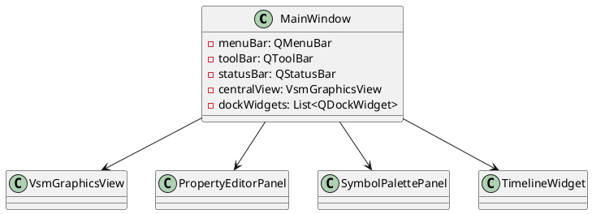
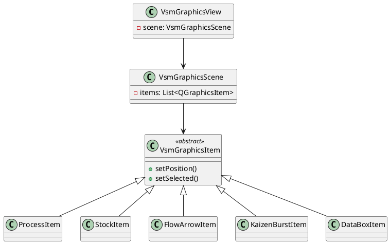
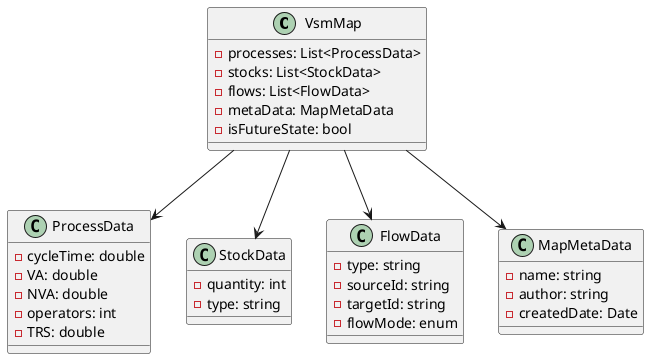
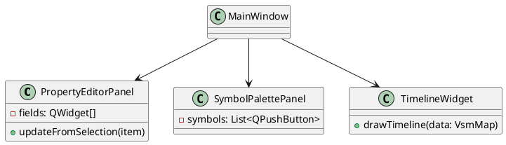
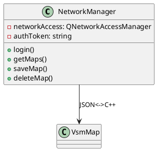
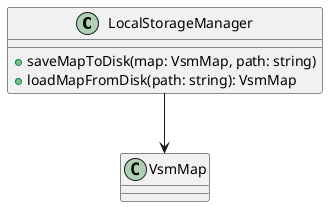
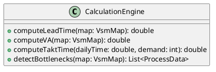
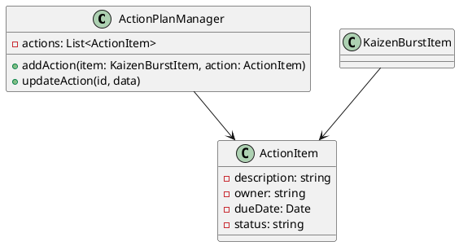
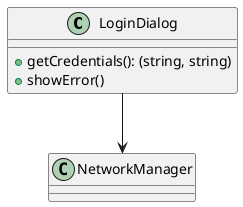
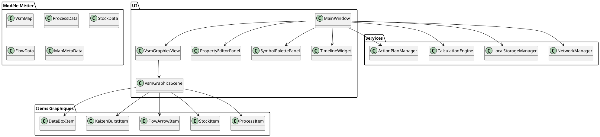

# 📦 Diagrammes de Classes - Client VSM (Qt)

> Ces diagrammes représentent la structure interne du client Qt de l'application VSM, regroupés par logique fonctionnelle : UI principale, éléments graphiques, modèles de données, communication réseau, stockage local, moteur de calcul, et plan d’action.

---

## 🎨 UI Principale (MainWindow et Docks)

## 🗺️ Éléments Graphiques (VSM Scene et Items)

## 🧠 Modèles de Données Métier (C++)

## ⚙️ Panneaux Latéraux (UI)

## 🌐 Communication Réseau (Client-Serveur)

## 💾 Stockage Local (Fichiers et Base de Données)

## ⚙️ Moteur de Calcul (Analyse et Optimisation)

## 📝 Plan d'Action (Actions et Suivi)

## 🔒 Authentification

## 📦 Organisation Générale

