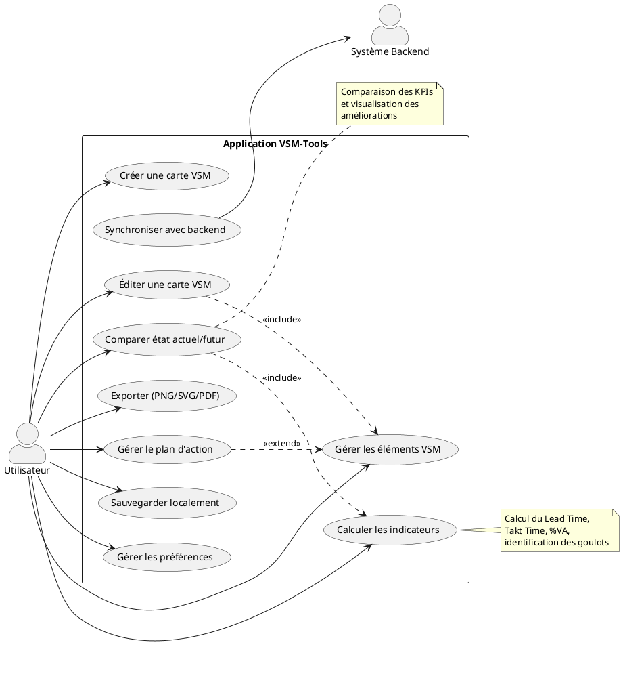
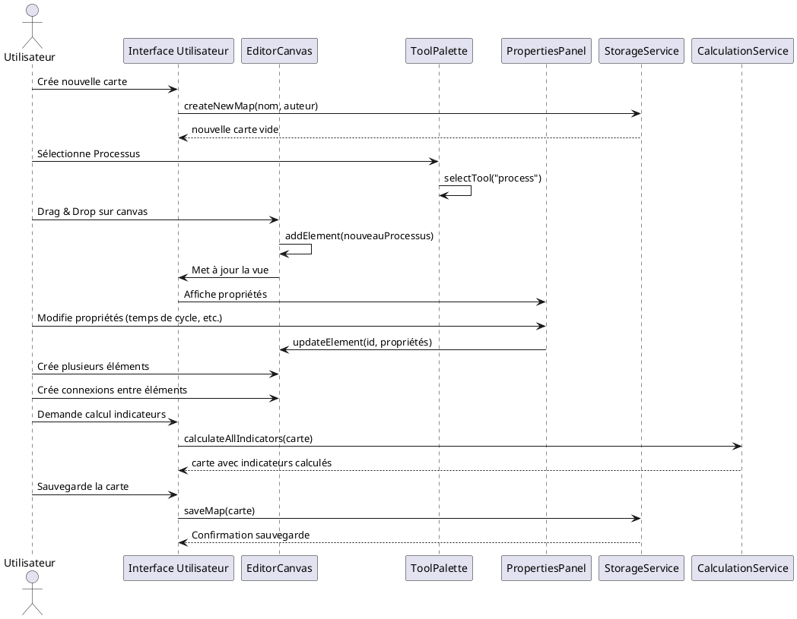
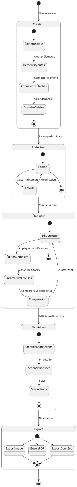
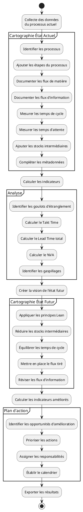
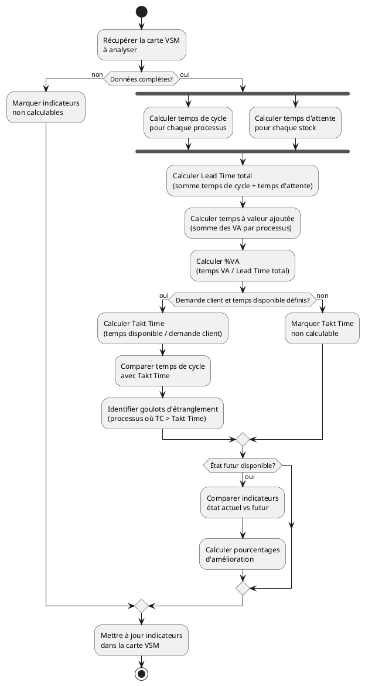

# Diagrammes UML VSM-Tools

Ce document présente les différents diagrammes UML pour l'application VSM-Tools, organisés par perspectives d'analyse et de conception.

## 1. Analyse Fonctionnelle

### 1.1 Diagramme de Cas d'Utilisation



## 2. Conception Orientée Objet

### 2.1 Diagramme de Classes

```plantuml
@startuml "Classes VSM-Tools"

' Classes principales
package "Types" {
  enum VsmElementType {
    PROCESS
    STOCK
    SUPPLIER
    CUSTOMER
    FLOW_ARROW
    KAIZEN_BURST
    DATA_BOX
    TEXT
  }
  
  enum FlowType {
    MATERIAL
    INFORMATION
    PUSH
    PULL
    FIFO
    ELECTRONIC
  }
  
  enum VsmMapState {
    CURRENT
    FUTURE
  }
  
  class MapMetaData {
    +name: string
    +author: string
    +createdDate: string
    +modifiedDate: string
    +appVersion: string
    +description: string
  }
  
  interface BaseElement {
    +id: string
    +type: VsmElementType
    +x: number
    +y: number
    +width: number
    +height: number
    +name: string
    +backgroundColor: string
    +borderColor: string
    +borderWidth: number
    +notes: string
  }
  
  class ProcessData {
    +cycleTime: number
    +valueAddedTime: number
    +nonValueAddedTime: number
    +operators: number
    +oee: number
    +availability: number
    +performance: number
    +quality: number
    +rejectRate: number
    +changeoverTime: number
    +batchSize: number
    +shifts: number
    +workingHours: number
  }
  
  class StockData {
    +quantity: number
    +leadTime: number
    +stockType: string
    +unit: string
    +management: string
    +unitCost: number
  }
  
  class SupplierData {
    +deliveryFrequency: string
    +leadTime: number
    +serviceRate: number
  }
  
  class CustomerData {
    +dailyDemand: number
    +taktTime: number
    +unit: string
  }
  
  class FlowArrowData {
    +sourceId: string
    +targetId: string
    +flowType: FlowType
    +points: number[][]
    +lineWidth: number
  }
  
  class KaizenBurstData {
    +description: string
    +priority: number
    +actionIds: string[]
  }
  
  class DataBoxData {
    +data: Array<{key: string, value: string|number}>
    +attachedToId: string
  }
  
  class VsmSettings {
    +availableTime: number
    +customerDemand: number
    +timeUnit: string
    +quantityUnit: string
    +dateFormat: string
    +decimalPlaces: number
    +defaultColors: object
  }
  
  class ActionItem {
    +id: string
    +kaizenId: string
    +description: string
    +owner: string
    +dueDate: string
    +startDate: string
    +completionDate: string
    +status: string
    +progress: number
    +notes: string
  }
  
  class VsmMap {
    +id: string
    +metaData: MapMetaData
    +state: VsmMapState
    +relatedMapId: string
    +settings: VsmSettings
    +elements: VsmElement[]
    +actions: ActionItem[]
    +indicators: object
  }
  
  class VsmComparison {
    +currentMapId: string
    +futureMapId: string
    +indicators: object
  }
}

package "Services" {
  class StorageService {
    +saveMap(map: VsmMap): Promise<void>
    +loadMap(id: string): Promise<VsmMap>
    +deleteMap(id: string): Promise<void>
    +listMaps(): Promise<MapMetaData[]>
    +createNewMap(name: string, author: string): VsmMap
    +createFutureStateMap(currentMap: VsmMap): VsmMap
    -isValidVsmMap(obj: any): boolean
  }
  
  class ApiService {
    -baseUrl: string
    -httpClient: object
    +login(username: string, password: string): Promise<boolean>
    +logout(): Promise<void>
    +checkAuthentication(): Promise<boolean>
    -refreshToken(): Promise<void>
    +getMaps(): Promise<VsmMap[]>
    +getMap(mapId: string): Promise<VsmMap>
    +saveMap(map: VsmMap): Promise<void>
    +deleteMap(mapId: string): Promise<void>
  }
  
  class CalculationService {
    +calculateTaktTime(availableTime: number, customerDemand: number): number
    +calculateTotalLeadTime(map: VsmMap): number
    +calculateTotalValueAddedTime(map: VsmMap): number
    +calculateValueAddedPercentage(map: VsmMap): number
    +identifyBottlenecks(map: VsmMap, taktTime: number): string[]
    +calculateAllIndicators(map: VsmMap): VsmMap
    +compareCurrentAndFutureMaps(currentMap: VsmMap, futureMap: VsmMap): VsmComparison
  }
}

package "Components" {
  class EditorCanvas {
    -canvas: Konva.Stage
    -scale: number
    -position: {x: number, y: number}
    +handleDragOver(event): void
    +handleDrop(event): void
    +handleZoom(factor: number): void
    +handlePan(dx: number, dy: number): void
    +selectElement(id: string): void
    +addElement(element: VsmElement): void
    +removeElement(id: string): void
    +connectElements(sourceId: string, targetId: string, flowType: FlowType): void
  }
  
  class ToolPalette {
    -selectedTool: string
    -categories: object[]
    +selectTool(toolId: string): void
    +handleDragStart(event, tool): void
    +renderToolCategories(): JSX.Element
  }
  
  class PropertiesPanel {
    -selectedElement: VsmElement
    +renderProperties(): JSX.Element
    +updateProperty(key: string, value: any): void
    +closePanel(): void
  }
}

' Relations
BaseElement <|-- ProcessData
BaseElement <|-- StockData
BaseElement <|-- SupplierData
BaseElement <|-- CustomerData
BaseElement <|-- FlowArrowData
BaseElement <|-- KaizenBurstData
BaseElement <|-- DataBoxData

VsmMap *-- "1" MapMetaData
VsmMap *-- "1" VsmSettings
VsmMap *-- "*" ProcessData
VsmMap *-- "*" StockData
VsmMap *-- "*" SupplierData
VsmMap *-- "*" CustomerData
VsmMap *-- "*" FlowArrowData
VsmMap *-- "*" KaizenBurstData
VsmMap *-- "*" DataBoxData
VsmMap *-- "*" ActionItem

CalculationService ..> VsmMap : calcule
StorageService ..> VsmMap : persiste
ApiService ..> VsmMap : synchronise

EditorCanvas ..> BaseElement : manipule
ToolPalette ..> VsmElementType : fournit
PropertiesPanel ..> BaseElement : édite

VsmComparison o-- "2" VsmMap : compare

@enduml
```



### 2.2 Diagramme de Séquence - Création d'une carte VSM



### 2.3 Diagramme d'États - Cycle de vie d'une carte VSM



## 3. Architecture Système

### 3.1 Diagramme de Composants

```plantuml
@startuml "Composants VSM-Tools"
!include <C4/C4_Container>

Person(utilisateur, "Utilisateur", "Créateur de cartes VSM")

System_Boundary(vsmtools, "VSM-Tools Application") {
  Container(frontend, "Processus Renderer", "React, TypeScript", "Interface utilisateur et interactivité")
  Container(main, "Processus Main", "Electron, TypeScript", "Gestion système et interface native")
  Container(services, "Services", "TypeScript", "Logique métier et gestion des données")
}

System_Ext(backend, "Backend Service", "Optionnel, pour synchronisation et collaboration")
System_Ext(filesystem, "Système de fichiers", "Stockage local des cartes VSM")

Rel(utilisateur, frontend, "Interagit avec")
Rel(frontend, main, "Communique via IPC")
Rel(frontend, services, "Utilise")
Rel(main, filesystem, "Lecture/écriture")
Rel(services, filesystem, "Persiste données")
Rel(services, backend, "Synchronise (optionnel)")

Container_Boundary(frontend_components, "Composants Frontend") {
  Component(app, "App", "Composant racine")
  Component(editor, "VsmEditor", "Édition de cartes")
  Component(properties, "PropertyPanel", "Édition des propriétés")
  Component(palette, "ToolPalette", "Palette d'outils")
  Component(timeline, "TimelineView", "Visualisation timeline")
  Component(toolbar, "Toolbar", "Barre d'outils")
}

Container_Boundary(services_components, "Services") {
  Component(storage, "StorageService", "Gestion stockage")
  Component(api, "ApiService", "Communication API")
  Component(calculation, "CalculationService", "Calculs VSM")
  Component(export, "ExportService", "Export des cartes")
}

Rel(app, editor, "Contient")
Rel(app, properties, "Contient")
Rel(app, palette, "Contient")
Rel(app, timeline, "Contient")
Rel(app, toolbar, "Contient")

Rel(editor, storage, "Utilise")
Rel(editor, calculation, "Utilise")
Rel(editor, export, "Utilise")
Rel(editor, api, "Utilise")

@enduml
```

### 3.2 Diagramme de Déploiement

```plantuml
@startuml "Déploiement VSM-Tools"
!include <material/common>
!include <material/laptop>
!include <material/server>

node "Poste de Travail Utilisateur" as workstation {
  MA_LAPTOP(laptop, "")
  rectangle "Application Electron" as app {
    component "Processus Principal" as main
    component "Processus Renderer" as renderer
    component "Services" as services
    
    component "Base de données locale" as localdb
    
    main -- renderer : IPC
    renderer -- services
    services -- localdb
  }
}

node "Serveur (Optionnel)" as server {
  MA_SERVER(server_icon, "")
  component "API Backend" as api
  database "Base de données" as db
  
  api -- db
}

node "Système de fichiers" as filesystem {
  folder "Fichiers VSM" as files
}

workstation -- server : HTTPS
workstation -- filesystem : Local I/O

@enduml
```

## 4. Modélisation Métier

### 4.1 Diagramme d'Activités - Analyse VSM



### 4.2 Diagramme d'Activités - Calcul des Indicateurs



## 5. Documentation supplémentaire

### 5.1 Notes sur les diagrammes

- **Diagramme de Classes** : Représente la structure statique du système VSM-Tools, montrant les principales classes, interfaces et leurs relations. Il inclut les types de données, services et composants UI essentiels.

- **Diagramme de Séquence** : Illustre les interactions entre les différents composants lors de la création d'une carte VSM, montrant le flux de messages entre l'utilisateur, l'interface et les services.

- **Diagramme d'États** : Décrit les différents états par lesquels passe une carte VSM durant son cycle de vie, de la création initiale à l'exportation finale.

- **Diagramme de Composants** : Présente l'architecture du système en mettant l'accent sur les composants logiciels principaux et leurs dépendances.

- **Diagramme de Déploiement** : Montre comment le système est déployé physiquement, y compris l'application Electron locale et l'intégration optionnelle avec un serveur backend.

- **Diagrammes d'Activités** : Décrivent les flux de travail métier, notamment la méthodologie d'analyse VSM et le processus de calcul des indicateurs.

### 5.2 Conventions de modélisation

- Les diagrammes suivent les conventions UML 2.5
- La nomenclature est cohérente avec les conventions de nommage du projet (camelCase pour les méthodes, PascalCase pour les classes)
- Les couleurs et styles visuels sont alignés avec l'identité visuelle du projet
- Les notes explicatives sont utilisées pour clarifier les concepts complexes